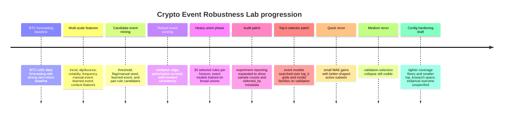

# Crypto Event Robustness Lab

## Executive summary

This project evolved into a **BTC-USD event-mining and selective-prediction research framework** built around three ideas: mine candidate market "events," stress-test those events with perturbation and rolling validation, and only make predictions on days the model claims are high-confidence. In the recorded artifacts, the pipeline ingests BTC-USD plus cross-asset context tickers, engineers multi-scale technical, frequency, manual-event, and learned-event features, generates candidate rules, scores them for validation edge and robustness, and writes out leaderboards, selected-event tables, prediction payloads, and toy-equity files.

The best recorded out-of-sample results came from the **patched quick run**, not from the broader heavy search. At the 1-day horizon, `hist_gb_top8_val_selected` achieved `return_mae=0.017009` versus the zero-return baseline `0.017027`, with `active_directional_accuracy=0.600` on `35` active test cases. At the 3-day horizon, `extra_trees_top8_val_selected` achieved `return_mae=0.029701` versus zero `0.029863`, with `active_directional_accuracy=0.611` on `36` active cases. Those are real wins, but they are **small** and based on **small active subsets**.

The main empirical finding is not "a profitable crypto bot was found." It is that the miner repeatedly surfaced a **pullback / near-low / recent-weakness regime family**: low `price_position_*`, negative `ret_sum_*`, low `trend_slope_*`, `drawdown_from_high_*`, and `seed_near_low_s30`. That repetition across quick, medium, and heavy runs suggests the framework was not latching onto pure nonsense, but the effect remained fragile: validation active accuracy often sat around `72%-76%` on roughly `29` validation cases and then fell sharply on test, sometimes to `50%-54%`.

The correct public framing is therefore **a time-series event-mining and robustness-testing framework** rather than a live-trading claim. Methodologically, the project already resembles **selective prediction** or **classification with abstention**: it sets a confidence threshold, accepts only a subset of cases, and trades off coverage against accuracy, which is exactly the risk-coverage setting studied in the selective prediction literature. Likewise, its walk-forward logic is aligned with rolling-origin forecast evaluation. What is still missing before any real edge claim is defensible is a frozen holdout, stronger significance testing under serial dependence, and richer data such as funding, open interest, order book, and on-chain flows.

## Project architecture and implemented modules

One important evidence note belongs up front. The recorded `src/experiment.py` and `src/models/event_models.py` artifacts capture the repo structure and function names, but the `event_models.py` snapshot predates the **validation-selected top-k** loop that is visible in the later quick and medium run logs. In other words, the final behavioral description of the patched selector is confirmed by the run traces, while exact post-patch line-level source for that selector is **unspecified** in the recorded artifact.



The timeline above is reconstructed from the run traces and the modified module behavior visible during development.

Table A lists the implemented modules, their purpose, and where they live. Paths come from the orchestrator imports and the model artifact; where the exact final patched source was not captured, the path is still known but the exact final line state is marked **unspecified**.

| Implemented module or idea | Purpose | Main file path |
|---|---|---|
| Config presets | Quick / medium / heavy experiment controls, candidate counts, coverage limits, model feature caps | `src/config.py` |
| Runners | Simple entry points that instantiate a preset and call the experiment | `RUN_QUICK.py`, `RUN_MEDIUM.py`, `RUN_HEAVY.py` |
| Data loading | Load BTC-USD plus context tickers and align history | `src/data_loader.py` |
| Feature assembly | Build final feature frame, split chronologically, infer feature columns, group features | `src/features/assembly.py` |
| Learned-event features | Learned event windows / clusters / PCA-style derived event features | `src/features/learned.py` |
| Candidate rule generation | Generate threshold, manual-seed/flag, learned-event, and pair rules | `src/events/rules.py` |
| Event scoring | Score candidate rules on validation plus robustness checks | `src/events/scoring.py` |
| Event priors baseline | Weighted conditional-prior ensemble over selected rules | `src/models/event_models.py::prior_event_ensemble` |
| Event model training phase I | Train classifiers on the union of all selected event rows | `src/models/event_models.py::train_event_models` pre-patch |
| Event model training phase II | Validation-select `top_k` and model family, then evaluate on test | `src/models/event_models.py::train_event_models` patched version, exact final file state unspecified |
| Metrics and baselines | Zero baseline, rolling-mean baselines, previous-direction baseline, active metrics, threshold search | `src/evaluation/metrics.py` |
| Toy backtest | Long/cash equity curve for active h=1 predictions only | `src/evaluation/backtest.py` |
| Experiment orchestration | Run full pipeline, save tables/plots/summary | `src/experiment.py` |
| Reporting | Output directory creation, config write-out, plots, markdown summary | `src/reporting.py` |

The implemented ideas themselves are clear enough to summarize technically.

### Feature and data layer

The project uses **daily BTC-USD** as the target series, augmented by context assets `ETH-USD`, `SPY`, `QQQ`, `GLD`, `TLT`, `DX-Y.NYB`, and `^VIX`. Feature engineering organizes columns into eight groups: `trend_momentum`, `dip_bounce`, `volatility`, `frequency`, `manual_events`, `learned_events`, `context`, and `basic`. In the recorded runs, feature counts expanded with mode: quick built `225` raw columns and `239` usable features; medium built `319` raw columns and `366` usable features; heavy built `396` raw columns and `474` usable features. The split was chronological and roughly `70/15/15`, with quick and medium using `2639 / 565 / 566` rows for train / val / test, and heavy using `2638 / 565 / 566`. Learned-feature generation also emitted repeated `Mean of empty slice` and `Degrees of freedom <= 0` warnings, which is a real cleanup target for early-window handling in `src/features/learned.py`.

**Inputs:** raw price history plus `ExperimentConfig`.
**Outputs:** engineered frame, chronological splits, feature-group inventory.
**Key hyperparameters:** `scales`, `fft_windows`, `learned_event_windows`, `learned_event_clusters`, `learned_event_pca_components`, `train_frac`, `val_frac`.
**Observed outcome:** richer modes increased dimensionality a lot, but the extra complexity did not meaningfully change the core signal family or produce decisive test gains.

### Candidate generation and robust scoring

`generate_candidate_rules()` produces the event vocabulary. From the config and outputs, the rule pool clearly includes **threshold rules** like `thr__ret_sum_14__<=_0.20`, **flag/manual-seed rules** like `flag__seed_near_low_s30`, **learned-event flags**, and optionally **pair rules**. The scoring stage, `score_candidate_rules()`, writes out tables with `rule_name`, `source`, `train_n`, `val_n`, `val_coverage`, `val_edge`, `noise_survival`, `wf_positive_frac`, and `robust_score`. The exact formula for `val_edge` and the exact weighting inside `robust_score` are **unspecified** from the available code snapshot, but behaviorally they were treated as higher-is-better validation and robustness quantities.

**Inputs:** `train`, `val`, full candidate rule list, horizon, config.
**Outputs:** candidate-score dataframe, later persisted as `candidate_scores_h{h}.csv` and `event_candidates_scored.csv`.
**Key hyperparameters:** `max_candidate_rules`, `max_pair_rules`, `quantiles`, `perturb_trials`, `perturb_noise_scale`, `perturb_threshold_scale`, `walk_forward_folds`, `walk_forward_gap`, `min_train_event_n`, `min_val_event_n`, `min_positive_fold_frac`, `selected_event_count`.
**Observed outcome:** the scorer consistently preferred **pullback / near-low / recent-weakness** rules. Quick `h=1` selected mostly `ret_sum_*` and `trend_slope_*` thresholds plus `seed_near_low_s30`; medium `h=1` and `h=3` shifted toward `price_position_*` and `ret_sum_*`; heavy added `drawdown_from_high_*` and a few learned flags. Even very high candidate scores did not guarantee final model success: heavy `h=5` contained `thr__drawdown_from_high_14__<=_0.20` with `val_edge=0.476190`, `noise_survival=1.0`, `wf_positive_frac=0.8`, and `robust_score=0.407976`, but the best final `h=5` event model still lost to zero on MAE.

### Event priors and event-model training

`prior_event_ensemble()` is a **non-trained rule-vote baseline**. It computes each selected rule's in-sample conditional direction and return, weights those by rule score, and produces a weighted event prior. This was conceptually useful as a sanity check but empirically weak. Across the recorded quick, medium, and heavy runs, `weighted_event_priors` repeatedly returned `active_n=0` and `active_coverage=0`, making it effectively dead code in the public story. It should either be repaired or removed from the clean repo.

`train_event_models()` had **two phases** in the project history.

The **first phase** trained models on the **union of all selected rules**. The recorded `event_models.py` artifact shows the old structure clearly: add `selected_event_*` flags; define active rows by the union of those flags; select features by absolute correlation to the direction label; fit three models (`hist_gb` as a random-forest stand-in, `extra_trees`, and `logistic`); then choose a confidence threshold on validation and report active metrics.

**Inputs:** `train`, `val`, `test`, `feature_cols`, `selected_rules`, `selected_scores`, `horizon`, `config`.
**Outputs:** leaderboard rows and prediction payloads containing `prob`, `return_pred`, `score`, `threshold`, `active`.
**Key hyperparameters:** `model_max_features`, `model_min_samples`, `min_active_coverage`, `max_active_coverage`, and the model-family defaults.
**Observed outcome in phase I:** heavy selected **30** event rules per horizon and then fit on very large active unions: `1831`, `1857`, `2109`, and `1947` active training rows at horizons `1`, `2`, `3`, and `5`, respectively. That is the signature of **dilution**: the "event model" was no longer specialized. Heavy still produced tiny MAE wins at `h=1`, `h=2`, and `h=3`, but the effect was small and inconsistent.

The **second phase** patched `train_event_models()` into a **validation-selected top-k search**. The run traces show a `validation-selecting event model over top_k grid` loop, testing grids such as `[1, 2, 3, 5, 8]` in quick and `[1, 2, 3, 5, 8, 12, 16]` in medium, across `hist_gb`, `extra_trees`, and `logistic`. Behaviorally, the patched function searched over `top_k`, scored validation candidates using active directional performance plus coverage/MAE considerations, then emitted a single `*_val_selected` test row with metadata in `selected_by`. The exact final line-level implementation is **unspecified** from the recorded file snapshot, but the behavior is explicit in the logs.

**Observed outcome in phase II:** quick improved the *shape* of the experiment. `h=1` selected `hist_gb top_k=8`; `h=3` selected `extra_trees top_k=8`. Test active coverage stayed around `6%`, and active-direction accuracy stayed above same-day baselines on those active days. Medium showed the remaining flaw: the selector still over-rewarded tiny validation pockets, producing `75.9%` validation active accuracy on `29` cases and then collapsing to `50.0%` on `44` cases at `h=1` and `53.8%` on just `13` cases at `h=3`.

### Metrics, thresholds, orchestration, and outputs

The metrics layer evaluates both **forecast error** and **selective accuracy**. `baseline_returns()` supplies a strong comparison set: `zero`, rolling mean return baselines such as `ret_mean_7`, `ret_mean_14`, `ret_mean_30`, `ret_mean_60`, `ret_mean_120`, and lag-direction baselines such as `prev_same_h` or `prev_1d_scaled`. `choose_confidence_threshold()` selects an active threshold from validation under coverage constraints. `evaluate_probability_model()` reports `return_mae`, `directional_accuracy`, `active_n`, `active_coverage`, `active_directional_accuracy`, and same-active baseline accuracies such as `same_active_zero_acc` and `same_active_ret_mean_60_acc`. This is a proper selective-prediction setup, where abstention and coverage matter as much as raw accuracy.

`run_experiment()` orchestrates the full pipeline and persists the main artifacts: `REPORT_SUMMARY.md`, `leaderboard.csv`, `event_candidates_scored.csv`, `selected_events.csv`, `predictions_and_equity.csv`, `01_return_mae_leaderboard.png`, and `03_event_robustness_scatter.png`. The patched run traces also show two important audit improvements: selected-event tables now print `train_n`, `val_n`, and `val_coverage`, and leaderboards now print the `selected_by` metadata describing the chosen model family, `top_k`, threshold, and rule-union counts. That reporting change matters because it makes selection bias much easier to diagnose.

## Empirical results and what the numbers say

The baseline story is simple and brutal: **zero return was already hard to beat**, especially on MAE. In every run, `zero` was the best or near-best baseline; rolling mean baselines usually lost to it. That makes small wins over zero worth recording, but it also means such wins must clear a high bar before they can be interpreted as a tradable signal. Genuine forecast evaluation should always be based on untouched test data and rolling-origin logic rather than in-sample fit, which is exactly why the selective / walk-forward design here is directionally correct.

Table B consolidates the run-verified outcomes from the recorded quick, medium, and heavy artifacts. Heavy rows are from the **pre-top-k union-of-all-events phase**, so validation active accuracy for those rows is **unspecified** in the artifact.

| Phase | Horizon | Model | MAE | Zero MAE | active_n | Val active acc | Test active acc | Short reading |
|---|---:|---|---:|---:|---:|---:|---:|---|
| Patched quick | 1 | `hist_gb_top8_val_selected` | 0.017009 | 0.017027 | 35 | 0.724 | 0.600 | Small MAE win; active subset looked useful |
| Patched quick | 3 | `extra_trees_top8_val_selected` | 0.029701 | 0.029863 | 36 | 0.759 | 0.611 | Best recorded active signal |
| Patched medium | 1 | `hist_gb_top8_val_selected` | 0.017036 | 0.017027 | 44 | 0.759 | 0.500 | Lost to zero on MAE; active accuracy collapsed |
| Patched medium | 3 | `extra_trees_top16_val_selected` | 0.029677 | 0.029865 | 13 | 0.759 | 0.538 | Tiny MAE win, tiny test sample |
| Pre-top-k heavy | 1 | `extra_trees` | 0.017030 | 0.017055 | 43 | unspecified | 0.605 | Union-of-30-events phase; slight win |
| Pre-top-k heavy | 2 | `extra_trees` | 0.024286 | 0.024364 | 61 | unspecified | 0.607 | Slight win; same-day momentum nearly tied |
| Pre-top-k heavy | 5 | `logistic` | 0.038664 | 0.037080 | 34 | unspecified | 0.618 | Attractive active accuracy, but worse MAE |

The best relative MAE improvement visible in the recorded artifacts was the quick `h=3` case, at roughly **0.54% relative improvement** over zero, while quick `h=1` was roughly **0.11%** and medium `h=3` roughly **0.63%**. Those are genuine improvements, but they are very small in economic magnitude and sit on top of small active samples.

Three patterns stand out. First, **quick was the cleanest result**. The 3-day quick model achieved `61.1%` active directional accuracy on `36` test cases while the same-day baselines on those exact active dates were only `44.4%`, `44.4%`, and `47.2%` for zero, previous-same-horizon direction, and 60-day momentum. That is the strongest evidence in the entire artifact set that the selector found something nontrivial.

Second, **medium exposed the remaining overfitting problem**. At `h=1`, the model selected by validation delivered only `50.0%` active directional accuracy on test, and its same-day 60-day momentum baseline was actually higher at `56.8%`. At `h=3`, the model still beat zero on MAE, but it only fired on `13` test cases. This is not enough evidence for a serious edge.

Third, **heavy showed dilution from broad event unions**. The heavy phase selected `30` rules per horizon and then trained on huge active unions, which is why active training rows reached `1831`, `1857`, `2109`, and `1947`. The framework still found small positive MAE deltas at `h=1` and `h=2`, but the effect was weak and not cleanly separated from the same-active baselines. The most dramatic example is `h=5`: logistic reached `61.8%` active directional accuracy on `34` cases, but its MAE was materially worse than zero. That is a textbook case of why active hit rate alone is not enough.

One more empirical fact is worth making explicit: the model often worked on a **broad rule union and a tiny final active slice at the same time**. In quick `h=3`, the selected row reports `rule_union_test_n=290`, but the final active subset after thresholding was only `36`; in medium `h=3`, `rule_union_test_n=362` collapsed to `13`. That means the final system is not "a special model for a tiny rule-defined regime" so much as "a classifier applied within a broad rule union, then sharply thresholded." That distinction matters when interpreting robustness.

## Lessons learned and failure modes

The first failure mode is **event-selection overfitting**. The project correctly uses validation, not test, to choose `top_k` and model family. That is legitimate model selection. But the combination of many candidate rules, many model families, and small active subsets means the selected validation winner can still have very high selection variance. This is exactly the type of risk-coverage problem the selective prediction literature warns about: selective systems can look excellent on filtered subsets while becoming unstable if the coverage is too small or the confidence proxy is poorly calibrated.

The second failure mode is **small active-sample instability**. The recurring validation pattern was `~72%-76%` active accuracy on about `29` validation cases. That is simply too small to support strong belief, especially once the selector is allowed to search over multiple `top_k` values and model families. The medium run makes this concrete: the selector loved `75.9%` on `29` validation cases and then fell to `53.8%` on `13` test cases. Time-series forecast evaluation literature strongly prefers genuine out-of-sample errors and rolling evaluation precisely because naive reuse of a single holdout can create false confidence.

The third failure mode is **dilution from the union of events**. The heavy phase used all selected events at once, so the event model frequently covered most of the train set. That is the opposite of what "event specialist" modeling is supposed to achieve. The patch to search over `top_k` was conceptually right and improved the shape of the experiment, but it still left a broad-rule-union / narrow-threshold dynamic that can mask fragility.

The fourth failure mode is **validation-selection bias even after robustness scoring**. `noise_survival` and `wf_positive_frac` clearly were not useless: they repeatedly pushed the system toward the same pullback regime family and away from random-looking rules. But robustness at the **candidate rule** level did not guarantee robustness after rule combination, thresholding, feature selection, and model-family search. This is the central empirical lesson of the repo. The candidate miner is probably finding a plausible regime family; the full downstream selector is still too eager.

The fifth failure mode is **reporting incompleteness**. The earlier experiment artifact printed selected rules without sample counts, and only later patches exposed `train_n`, `val_n`, `val_coverage`, and `selected_by`. That was the right fix, but the repo still needs a standard **train / validation / test metric table per chosen model**. Without that degradation path, overfitting cannot be diagnosed at a glance.

The sixth lesson is strategic: **daily OHLCV + broad macro context may simply be too weak a data substrate** for a strong BTC directional edge. The forecasting and finance literature is full of warnings that backtest overfitting is especially easy when many configurations are tried against one history. The solution is usually not another clever meta-model; it is either a better validation design or better data.

## Validation roadmap and next experiments

The next stage should be a tighter experimental pipeline, not a broader model zoo.


This pipeline aligns with selective prediction's risk-coverage logic, rolling-origin forecast evaluation, and the need for dependence-aware forecast comparison in time series.

Table C prioritizes the concrete next experiments, the files they touch, and explicit acceptance criteria.

| Priority | Experiment | Files to change | Effort | Metrics to track | Acceptance criteria |
|---|---|---|---|---|---|
| High | Conservative `top_k` pruning plus higher `min_active_coverage` | `src/config.py`, `src/models/event_models.py`, `src/experiment.py` | Small | `return_mae`, `active_n`, `active_coverage`, `active_directional_accuracy`, same-day baselines, val-test gap | Test active accuracy exceeds best same-day baseline by at least 3 pp, `active_n >= 50`, and val-test active gap is under 10 pp |
| High | Frozen holdout | `src/config.py`, `src/experiment.py`, new runner such as `RUN_FROZEN.py` | Small | Same as above plus MAE delta vs zero on untouched dates | Same sign of improvement on both normal test and frozen holdout; no code changes after holdout lock |
| High | Out-of-time replication with multiple rolling windows | `src/experiment.py`, split utilities in `src/features/assembly.py` or new helper | Medium | Window-by-window MAE delta, active accuracy, rule-family recurrence | Positive MAE delta in at least 2 of 3 non-overlapping windows and no single window dominating the conclusion |
| High | BTC/ETH cross-asset and spread task | `src/data_loader.py`, `src/features/assembly.py`, `src/events/rules.py`, `src/experiment.py`, `src/config.py` | Medium | Spread MAE, sign accuracy, mean-reversion hit rate, same-day baselines | Either BTC and ETH both show consistent edge, or BTC/ETH spread task beats zero and simple AR-style baselines across windows |
| High | Add richer crypto structure: funding, open interest, liquidations, order book, on-chain flows | `src/data_loader.py`, new feature modules such as `src/features/onchain.py` and `src/features/microstructure.py`, `src/config.py` | Large | Incremental lift over OHLC-only model, ablation deltas, stability of selected rules | Added data improves test objective in at least 2 windows and survives ablations |
| Medium | Multi-asset stacking | New `src/models/stacking.py` or extend `src/models/event_models.py`, plus `src/experiment.py` | Medium | Ensemble calibration, MAE, active accuracy, coverage | Stacked model beats best standalone on frozen holdout without shrinking to an unusably tiny active subset |
| Medium | Dependent-data bootstrap and model-comparison tests | New `src/evaluation/stats.py`, `src/experiment.py`, `src/reporting.py` | Medium | Bootstrap CI for MAE delta and active-accuracy edge, DM/MCS p-values | Confidence interval mostly above zero or model remains in the superior set under MCS-style comparison |
| Medium | Full ablation matrix and weighted-priors cleanup | `src/experiment.py`, `src/config.py`, notebooks/tests | Small | Performance by feature family, by event family, by candidate source; `active_n` for priors | At least one event family remains useful after ablation; `weighted_event_priors` either gains nonzero activity or is removed |

A few of those items deserve more concrete implementation notes.

The **coverage-floor rerun** is the cheapest high-value experiment. Medium already demonstrated that `29` validation cases are too few. Raise `min_active_coverage`, narrow `event_top_k_grid`, and cap `model_max_features`. The later config hardening patch during development moved in exactly this direction, but the corresponding run artifact is **unspecified**, so it should be rerun and documented cleanly.

The **frozen holdout** is the single most important credibility upgrade. The repo already uses chronological splits, but repeated human iteration against one test period can still create research overfitting. A second untouched segment brings the workflow closer to "research set versus final audit set," which is standard good practice in forecasting.

The **BTC/ETH experiment** should branch in two directions. One branch is **asset transfer**, where the same event families are mined separately on BTC and ETH to see whether the pullback regime generalizes. The other is **relative value**, where the target becomes a BTC/ETH spread or residual rather than raw BTC direction. Relative-value tasks are often structurally easier than raw beta-like direction prediction because they cancel some market-wide drift. The required data infrastructure already partly exists through the context-ticker design.

The **significance-testing package** should not rely on naive IID assumptions. Forecast-comparison tests such as Diebold-Mariano are standard, but recent work shows that strong dependence and heavy tails can badly distort inference if handled carelessly. The clean solution is a dependence-aware bootstrap for the loss differential, plus a superior-model procedure or model confidence set when many variants were tried.

## Repo cleanup and publication plan

This project is already large enough to become a strong small-to-medium public repo if it is treated as a **reproducible research framework** rather than a "solved trading product." The current run artifacts already generate the right kinds of outputs to support that story.

A clean public layout should look like this:

```text
crypto_event_robustness_lab/
  README.md
  RESULTS.md
  REPRODUCIBILITY.md
  requirements.txt
  RUN_QUICK.py
  RUN_MEDIUM.py
  RUN_HEAVY.py
  src/
    config.py
    experiment.py
    data_loader.py
    reporting.py
    features/
      assembly.py
      learned.py
      __init__.py
    events/
      rules.py
      scoring.py
      __init__.py
    models/
      event_models.py
      __init__.py
    evaluation/
      metrics.py
      backtest.py
      stats.py              # new
      __init__.py
  docs/
    methodology.md
    validation_protocol.md
    data_sources.md
    reproducibility_checklist.md
  example_outputs/
    quick/
      leaderboard.csv
      selected_events.csv
      event_candidates_scored.csv
      01_return_mae_leaderboard.png
      03_event_robustness_scatter.png
    medium/
      leaderboard.csv
      selected_events.csv
  notebooks/
    00_reproduce_quick.ipynb
    01_event_family_audit.ipynb
    02_val_vs_test_gap_audit.ipynb
    03_bootstrap_significance.ipynb
  tests/
    test_no_leakage_splits.py
    test_rule_generation.py
    test_scoring_schema.py
    test_threshold_selection.py
```

The cleanup rule should be strict. Keep `RUN_QUICK.py` and `RUN_MEDIUM.py` as public entry points, keep `RUN_HEAVY.py` only if its cost and exploratory role are clearly documented, keep the modular `src/` code, and archive stale intermediate scripts or duplicate experiment versions. The only output folders worth checking into the repo are **sanitized example outputs** from quick and medium. Heavy can be summarized in `RESULTS.md` without dumping the whole directory. The `weighted_event_priors` path should either be fixed to produce meaningful actives or removed from the public README and leaderboards.

The docs layer should do more than describe the code. `README.md` should explain the problem, the selective-prediction framing, why zero is a hard baseline, and the strongest result with caveats. `RESULTS.md` should include a short chronology of the heavy union-of-events phase and the later top-k selector phase. `methodology.md` should fix definitions for `val_edge`, `robust_score`, and every active metric. `reproducibility_checklist.md` should document seeds, exact split dates, ticker universe, feature flags, and the rule that the test set is never used to choose parameters.

The public example visuals should stay focused. The current artifacts already emit `01_return_mae_leaderboard.png` and `03_event_robustness_scatter.png`. Add four more: an **active accuracy vs sample size scatter**, a **validation vs test active-accuracy gap plot**, a **top-k profile by horizon**, and a **risk-coverage curve**. The last one fits the selective prediction literature especially well, because the whole project is effectively abstention-aware.

## Methods and data sources worth citing

For the methodology section of the repo, the strongest citations are straightforward.

For **selective prediction / abstention**, cite Geifman and El-Yaniv's selective classification paper and SelectiveNet. Those two sources establish the risk-coverage framing that best matches this repo's active-threshold logic, while the 2023 survey is useful as a broader reference on reject-option systems.

For **forecast evaluation**, cite Hyndman and Athanasopoulos on genuine forecast errors and rolling-origin cross-validation, and Cerqueira-Torgo-Mozetič on empirical evaluation methods for time-series forecasting. Those sources justify why this repo should continue emphasizing chronological splits, rolling replication, and out-of-sample error over residual fit.

For **event discovery in time series**, cite work on **shapelets** and the **matrix profile**. Shapelets provide the clearest "interpretable subsequence as predictive primitive" analogy, while the matrix profile literature gives a broad, modern reference for motif, discord, and subsequence discovery in time-series mining. Those are the closest research lineages to the repo's learned-event and event-mining intuition.

For **forecast comparison and overfitting control**, cite Carr and López de Prado on backtest overfitting risk, the newer cautionary work on Diebold-Mariano under strong dependence, and Hansen-style model confidence set references. Those are the right anchors for the repo's proposed bootstrap-and-comparison upgrade.

For **richer data**, the most defensible sources are official docs. Glassnode documents a unified API and a large library of on-chain and crypto financial metrics. Coin Metrics documents separate network-data, market-data, and tagging-metadata product lines. CoinAPI documents REST/WebSocket access to real-time and historical market data including OHLCV, trades, and order books. Binance and Bybit each provide official funding-rate history endpoints, while Hyperliquid exposes perpetual contexts that include current funding, open interest, mark price, and oracle price. Dune and Flipside document queryable on-chain data platforms that are useful for exchange-flow, DeFi, and wallet-behavior features.

## Ready-to-paste README and RESULTS snippets

The following text is suitable for the top of `README.md`:

```markdown
# Crypto Event Robustness Lab

Crypto Event Robustness Lab is a research framework for testing whether event-based crypto signals generalize under strong baselines, perturbation checks, and rolling time-series validation.

The system mines candidate market events from BTC-USD and cross-asset context features, scores those events for validation edge and robustness, and then trains selective event models that abstain on low-confidence days. The goal is not to maximize in-sample fit, but to identify whether any event family survives out-of-sample evaluation against zero-return and momentum-style baselines.
```

This README framing matches both the code structure and the actual empirical evidence in the recorded runs.

A concise "best result" snippet for `RESULTS.md` can read like this:

```markdown
## Best recorded result

The strongest recorded out-of-sample result came from the quick 3-day selective event model:

- Model: `extra_trees_top8_val_selected`
- Test MAE: `0.029701`
- Zero-return MAE: `0.029863`
- Active directional accuracy: `61.1%`
- Active test cases: `36`

This result suggests that a small pullback / near-low event family may contain a weak short-horizon signal. However, the effect is still sample-limited and validation-to-test decay remains substantial, so the repo does not claim a production trading edge.
```

Those exact numbers come from the quick run artifact and should be presented with the caveat already embedded in the prose.

A short methodology note can read like this:

```markdown
## Methodology caveat

This repository uses validation data for model selection, including event filtering, top-k rule selection, and confidence-threshold tuning. That is appropriate and does not use test data directly, but it still creates selection variance when the active subset is small. For that reason, all reported test results should be treated as evidence levels, not proof, until they are replicated on a frozen holdout and across multiple out-of-time windows.
```

That caveat is both statistically appropriate and directly supported by the project's own medium-run failure mode.